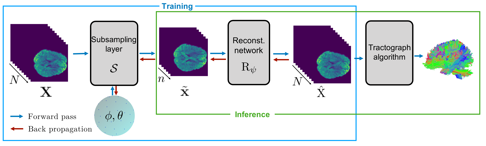

# Learned Diffusion MRI Acquisition Parameters for Accelerated Tractography

This repository contains a PyTorch implementation of the paper:

Change
[PILOT: Physics-Informed Learned Optimal Trajectories for Accelerated MRI](https://arxiv.org/abs/1909.05773).

Tomer Weiss (<tomer196@gmail.com>), Ortal Senouf, Sanketh Vedula, Oleg Michailovich, Michael Zibulevsky, Alex Bronstein

<p align="center">
       
</p>

## Introduction

Tractography is an important tool in neuroscience that enables reconstructing 3D structure of the white matter. Tractograhpy algorithms use diffusion-weighted Magnetic Resonance Imaging (DWI or dMRI), DWI data contains multiple volumes acquired with different diffusion gradient directions. The prohibitively long acquisition time needed for acquiring multiple diffusion directions limits the resolution and its practical use in clinical setting. In this work, we propose an algorithm to simultaneously learn the diffusion directions with the reconstruction model. We demonstrate that the learned directions, together with the reconstruction network, lead to further improvements on the obtained tractography. We conduct a thorough quantitative study on the data obtained from the human connectome project using a variety of metrics to objectively evaluate the obtained tractography. Although using neural network for reconstruction is a powerful tool it is not yet accepted as a valid tool in many applications, we claim that our learned directions can deployed and used directly even without neural network reconstruction. We showed that this approch can also lead to sizeable improvements in the tractography; we also showed that our sampling patterns generalize to datasets outside of the human connectome project.

This repo contains the codes to replicate our experiment for reconstruction.
Learned directions for few acceleration factors aviliable in 'bves/'

## Dependencies

To install other requirements through `$ pip install -r requirements.txt`.

## Usage

First you should download the Diffusion Preprocessed datset from the Humman Connectome Project (HCP) [HCP](https://db.humanconnectome.org/) 
pre-process the dataset by running (first update the location of the downloaded dataset):
```bash
python data/create_dataset.py
```
See 'exp.py' for basic use.

## Citing this Work - replace
Please cite our work if you find this approach useful in your research:
```latex
@ARTICLE{weiss2019pilot,
       author = {{Weiss}, Tomer and {Senouf}, Ortal and {Vedula}, Sanketh and
         {Michailovich}, Oleg and {Zibulevsky}, Michael and {Bronstein}, Alex},
       title = "{PILOT: Physics-Informed Learned Optimal Trajectories for Accelerated MRI}",
       journal = {arXiv e-prints},
       year = "2019",
       archivePrefix = {arXiv},
       eprint = {1909.05773},
}
```

## References
We use the [fastMRI](https://github.com/facebookresearch/fastMRI) as starter template.
